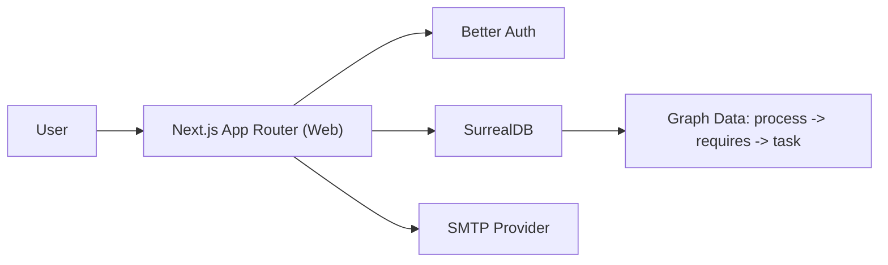

# GovQuest

[](https://nextjs.org/)
[](https://www.typescriptlang.org/)
[](https://surrealdb.com/)
[](https://opensource.org/licenses/MIT)

GovQuest is a web platform that helps citizens navigate Ethiopian public-service processes through clear, drill-down task flows, community tips, and persistent progress tracking.

## Why GovQuest

Public-service procedures are often hard to interpret, easy to forget, and full of hidden dependencies. GovQuest turns them into guided, nested quests so users can:

- understand each step and its output artifact
- track progress across sessions and devices
- learn from community tips tied to specific tasks
- submit direct product feedback from inside the app

## Core Capabilities

- Nested process graphs (`process -> requires -> task`) rendered as an interactive quest tree
- Process start/continue/complete lifecycle with server-side persistence
- Community feed per task with upvote/downvote support
- Better Auth login (email/password + Google OAuth)
- Feedback modal with SMTP delivery for operations visibility
- Containerized local and production workflows

## Architecture



## Tech Stack

- `Next.js` (App Router) + `TypeScript`
- `Tailwind CSS` + `shadcn/ui`
- `SurrealDB` (graph-native schema and queries)
- `Better Auth`
- `Nodemailer`
- `Docker Compose`

## Project Structure

```text
src/
  app/                 # routes, server actions, layouts
  components/          # UI and feature components
  lib/                 # db/auth/session/domain helpers
surreal/
  schema.surql         # production schema
  schema-and-seed.surql
  catalog-prod.surql   # generated production catalog seed
scripts/
  build-prod-catalog.sh
```

## Quick Start (Development)

### Prerequisites

- Node.js `20+`
- pnpm `10+`
- Docker + Docker Compose

### 1) Install dependencies

```bash
pnpm install
```

### 2) Configure environment

```bash
cp .env.example .env
```

### 3) Start database + seed, then app

```bash
pnpm db:up
pnpm dev
```

Local endpoints:

- App: `http://localhost:3000`
- MailHog (dev SMTP inbox): `http://localhost:8025`

Stop local data services:

```bash
pnpm db:down
```

## Production (Docker Compose)

### Start

```bash
docker compose up -d --build
```

### Stop

```bash
docker compose down
```

The app container listens on `127.0.0.1:3000`; place a reverse proxy with TLS in front of it.

## Content and Data Workflow

`surreal/schema-and-seed.surql` is the editable source of truth for process/task content.

When preparing production content updates:

```bash
pnpm db:catalog:build
```

This regenerates `surreal/catalog-prod.surql` from the hand-authored source file for production import.

## Scripts

- `pnpm dev` - run development server
- `pnpm build` - build production bundle
- `pnpm start` - run production server
- `pnpm typecheck` - TypeScript checks
- `pnpm db:up` - start dev SurrealDB + seed
- `pnpm db:down` - stop dev services
- `pnpm db:logs` - view seed/db logs
- `pnpm db:catalog:build` - generate production catalog seed
- `pnpm db:schema:apply` - apply production schema service
- `pnpm prod:up` - start production compose stack
- `pnpm prod:down` - stop production compose stack

## Authentication Notes

Google sign-in requires:

- `GOOGLE_CLIENT_ID`
- `GOOGLE_CLIENT_SECRET`
- matching callback URL/domain configuration in Google Cloud Console

## Environment Variables

Primary runtime variables are listed in `.env.example`, including:

- app URLs and trusted origins
- Better Auth secret and rate limits
- SurrealDB namespace/database credentials
- Google OAuth credentials (optional)
- SMTP settings and feedback recipient address

## Contributing

1. Create a branch.
2. Implement changes with tests/checks.
3. Run:

```bash
pnpm typecheck
pnpm build
```

4. Open a pull request with a focused summary.

## License

Licensed under the MIT License. See [`LICENSE`](LICENSE).
